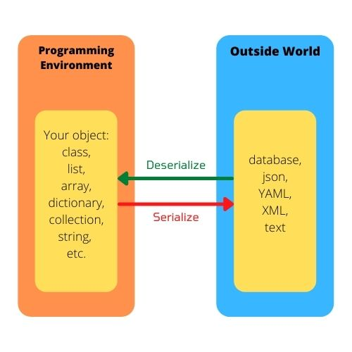

# Serialize Versus Deserialize

Remembering the terms for moving data in and out of your programming environment is hard.

## Serialize

Convert data from the objects in your programming environment to a format ready for external storage.

## Deserialize

Take data from an external source and import to one of the language's objects or types.

## Visual

This visual helps me remember which is which.

## References

Wikipedia [article on Serialization](https://en.wikipedia.org/wiki/Serialization).
