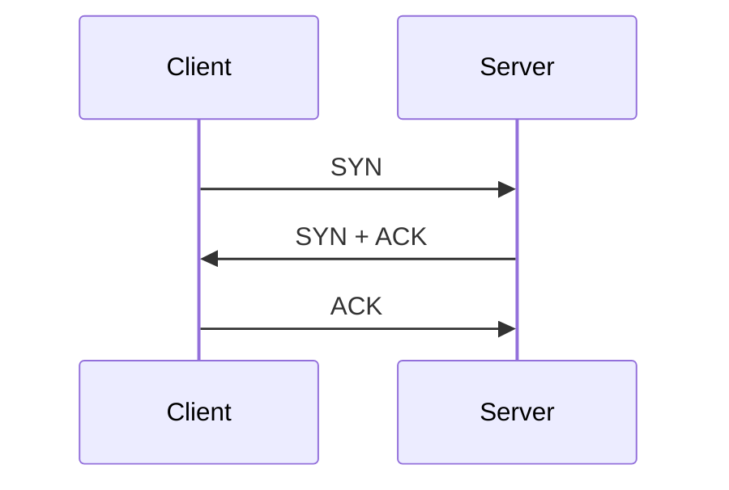

# TCP Three-Way Handshake

## Initial Conditions

+ No connection established
+ Server is listening

## Three-Way Handshake Sequence

The client initiates a connection by sending the `SYN`.
Then, the server responds to the client with a `SYN + ACK`.
Finally, the client establishes the connection by sending the `ACK`.

## References

+ Transmission Control Protocol [RFC 793](https://www.rfc-editor.org/rfc/rfc793.html)
+ Wireshark has a less formal explanation [here](https://wiki.wireshark.org/TCP_3_way_handshaking).
