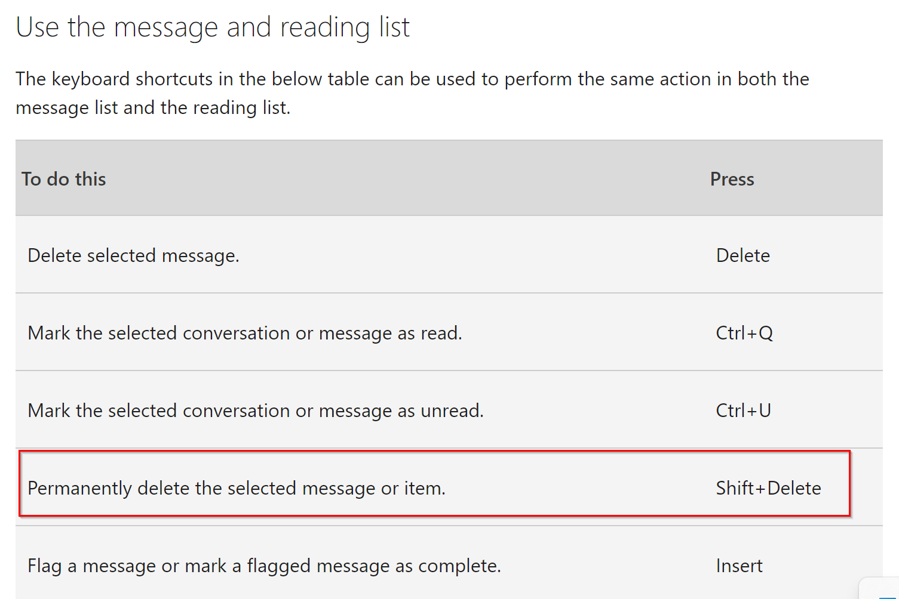

# Permanently Delete Message In Outlook

>[!Warning]
>This is a warning about the existence of this option and not a recommendation for its use.

Outlook has a *nuclear* option for deleting messages.
If you use the combination of `Shift + Delete` the message is permanently deleted.
The message will not be placed in the *Deleted Items* folder.

## Recovery Options For Permanently Deleted Messages

There are very few recovery options for permanently deleted messages.
Depending on your organization's policies, the only option may be an eDiscovery search using Purview or other compliance tools.
